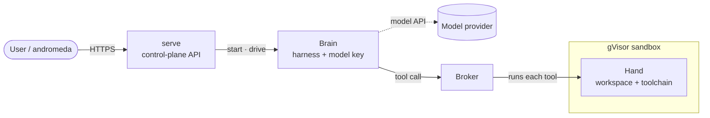

# Architecture

AgentPlane runs each session as a gVisor **actor** on [Agent Substrate](https://github.com/agent-substrate/substrate), split into a **brain** that reasons and a **hand** that executes, with a **broker** that runs tools in the hand from outside the sandbox.

The model's code runs only inside the sandbox; the model key stays in the brain, and tools run in the hand only through the broker.

## The pieces

| Component | Role |
|---|---|
| **serve** | The control-plane API — sessions, agents, credentials, approvals. |
| **brain** | Runs the harness (claude-code, pi, or codex) and holds the model key. |
| **hand** | A gVisor sandbox holding the durable `/workspace` and a toolchain — where the model's commands run. |
| **broker** | Runs each tool in the hand via the control plane's exec path, so the runtime stays *outside* gVisor. Also the MCP client to the agent's external `mcp:` servers, federating their tools — the brain never dials an upstream directly. |
| **Agent Substrate** | The actor runtime: lifecycle, checkpoint/restore, and networking. |

## Trust boundary

The gVisor sandbox is the boundary against model-generated code. The hand holds only the workspace and a toolchain — no credentials and none of AgentPlane's own code — so a tool has nothing privileged to read or rewrite. The model key stays in the brain, which the model never runs code in.
