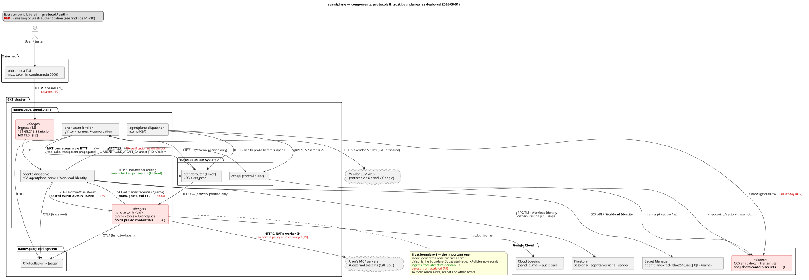
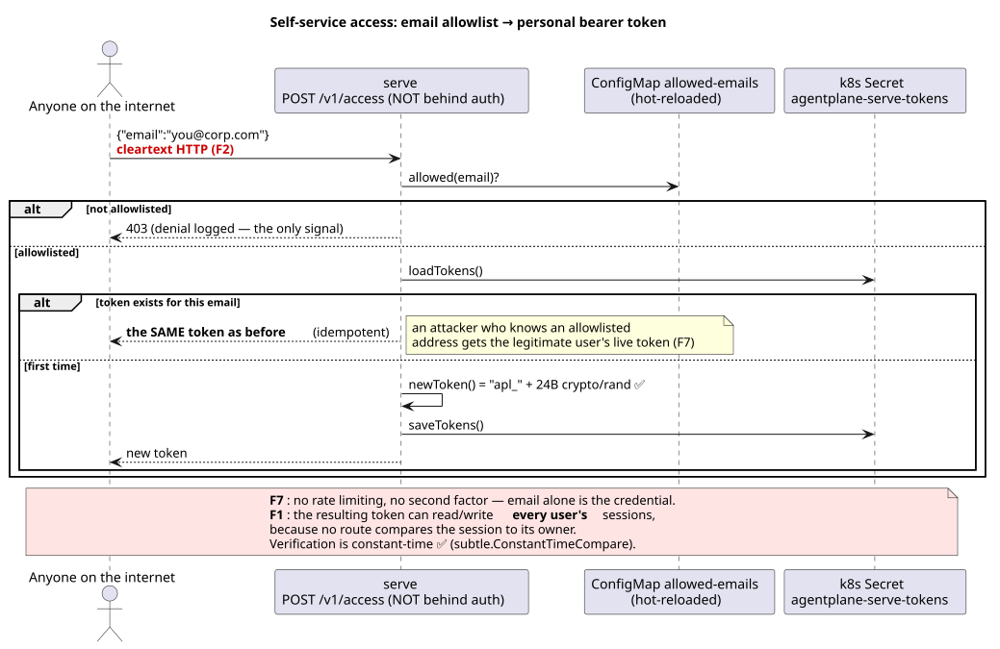
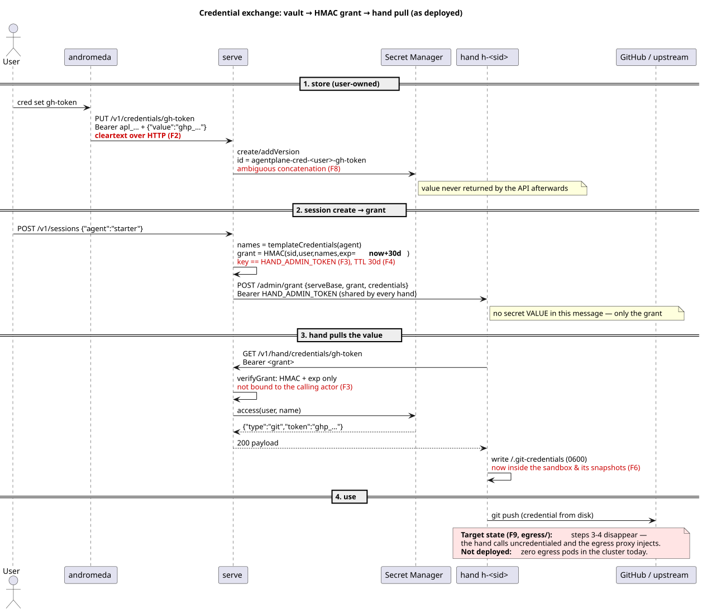
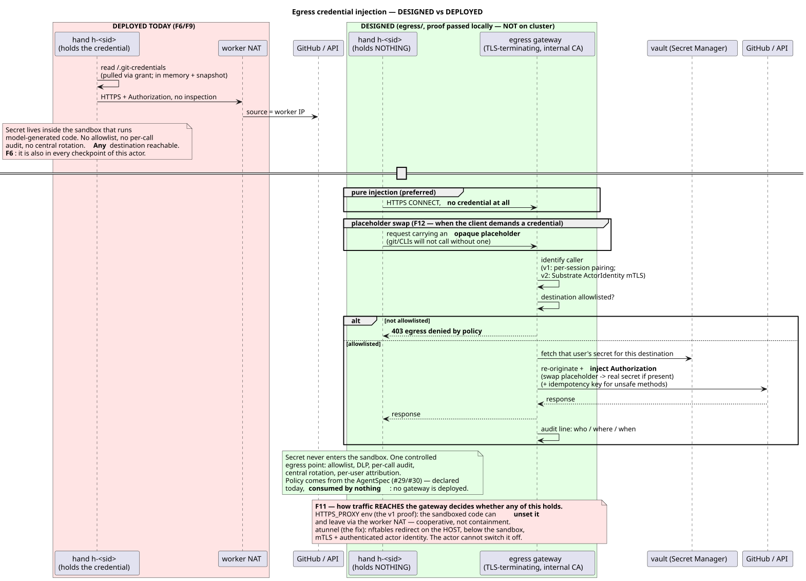
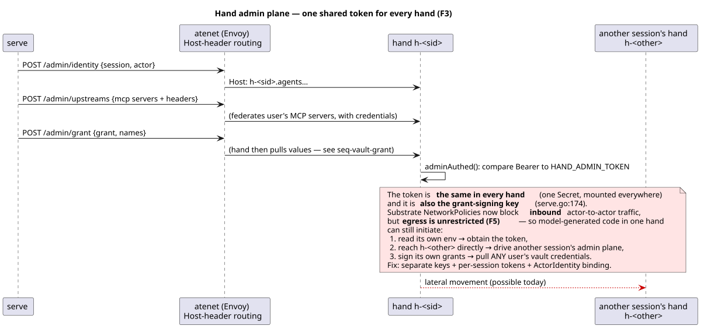
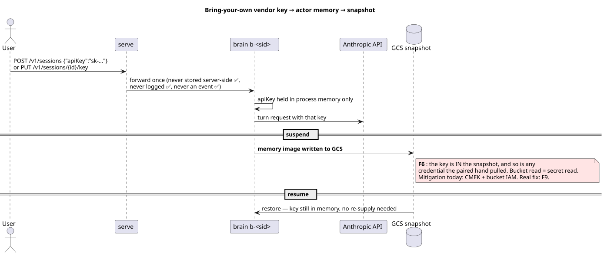
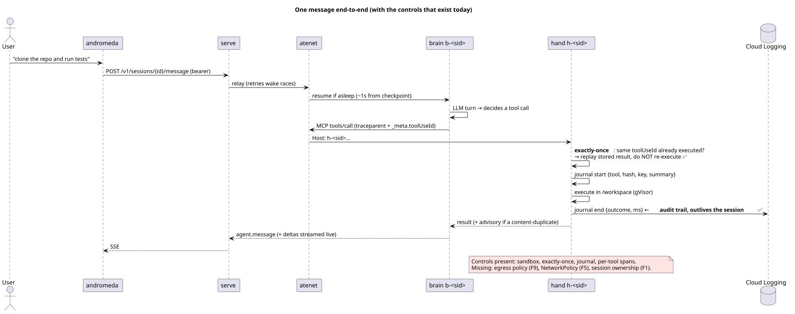

# Threat model

**Scope:** the whole agentplane platform as *deployed today* (2026-08-04),
not as designed. Every claim below cites the code or a live cluster check;
where the intended design differs from reality, both are shown.

**Status at a glance.** Findings are marked FIXED / PARTIAL / OPEN against the
running cluster, not against merged code — the distinction matters, because F10
is fixed in code and still inactive in production for want of one env var.

| | |
|---|---|
| FIXED | F1, F3, F4, F5, F7, F8 |
| PARTIAL | F6, F9 (git only), F10 (code merged, not enabled) |
| OPEN | F2, F11, F12, F13 |

Code is cited by *function*, not line number: every line-number citation in the
first revision of this document had drifted within two days and pointed at
unrelated code, which is worse than no citation at all.

**Method:** STRIDE per element over a data-flow diagram with explicit trust
boundaries, plus an asset inventory and abuse cases. Diagrams are PlantUML
committed beside this file so they diff in review:

Rendered SVGs are committed beside each source so the docs site and GitHub
show them without a PlantUML build; regenerate after editing a `.puml` with:

```bash
docker run --rm -v "$PWD":/data -w /data plantuml/plantuml -tsvg -o /data *.puml
```

### The system



Every arrow carries its protocol **and** its authentication mechanism; red
marks where there is none. Source: [`c4-components.puml`](c4-components.puml).

### Credential and token exchanges

Each of these is a place where a secret changes hands — the flows worth
attacking, drawn as deployed rather than as designed.

**Self-service access — email allowlist to bearer token** ([source](seq-access-token.puml))



**Credential vault to hand, via HMAC grant** ([source](seq-vault-grant.puml))



**Egress credential injection — designed vs deployed** ([source](seq-egress-injection.puml))



**Hand admin plane — one shared token for every hand** ([source](seq-hand-admin.puml))



**Bring-your-own vendor key into actor memory and snapshots** ([source](seq-byo-key.puml))



**A message end-to-end, with the controls that exist today** ([source](seq-tool-call.puml))



## 1. Assets

| Asset | Where it lives | Impact if disclosed |
|---|---|---|
| User access tokens (`apl_…`) | k8s Secret `agentplane-serve-tokens`, client `~/.andromeda/config.json` (0600) | full API access **as that user, and to every other user's sessions** (see F1) |
| Third-party credentials (GitHub PAT, …) | GCP Secret Manager `agentplane-cred-<user>-<name>`; **copied into hand actor memory + `~/.git-credentials`** on grant | attacker acts as the user on their external systems |
| Vendor API keys (BYO + shared) | actor memory; shared key in k8s Secret | billing theft; prompt/response access |
| Memory snapshots | GCS `gs://…/agentplane/` | **contain conversation + BYO key + pulled credentials** — the highest-value asset |
| Transcripts (escrow) | GCS `gs://…/transcripts/` | conversation disclosure |
| Execution journal | actor `/workspace` + Cloud Logging | reveals commands run (by design — it is the audit trail) |
| Grant-signing key | k8s Secret `agentplane-grant-key`, env in **serve only** | forge grants for any user/credential — no longer shared with hands (F3 fixed) |
| Hand admin token | k8s Secret `agentplane-hand-admin`, env in every hand | drive another session's hand admin plane |
| Session metadata | **Firestore** `sessions/{sid}` — owner, agent, version pin, activity, usage | maps sessions to the people who own them; reveals who ran what and what it cost |
| Agent definitions + version history | **Firestore** `agents/{name}/versions/{n}` — the submitted spec, verbatim | system prompts and tool policy; a writer could point new sessions at an attacker-authored agent |
| Lifetime spend per user | **Firestore** `usage/{email}` | billing/usage disclosure, keyed by email |
| Repository tokens in transit | **git-proxy** process memory, for the life of one request | the only component that resolves a git credential; holds no GCP access of its own and resolves through serve, so a compromise yields one user's token per grant rather than the vault |

## 2. Trust boundaries

1. **Internet ↔ LB** — `http://136.68.213.85.nip.io`, **no TLS** (verified: ingress `tls: NONE`)
2. **LB ↔ serve** — in-cluster HTTP
3. **serve ↔ Substrate control plane** — gRPC/TLS. `ateapiTLS()` verifies against
   `AGENTPLANE_ATEAPI_CA` when set and warns loudly when not; **the deployment does
   not set it**, so verification is off in practice (F10)
4. **worker ↔ actor** — gVisor sandbox: *the* boundary against model-generated code
5. **actor ↔ actor / actor ↔ serve** — atenet (Envoy), Host-header routed.
   Substrate now ships per-pool NetworkPolicies (`substrate-brain-pool-*`,
   `substrate-hand-pool-*`) — **`policyTypes: [Ingress]` only**, admitting just
   `atenet-router`. Actor-to-actor *inbound* is therefore closed; **egress is
   entirely unrestricted** (F5)
6. **cluster ↔ GCP + vendor APIs** — Workload Identity; actor egress NAT'd behind the worker IP

## 3. Findings

**Open findings first, then the fixed ones as a table.** Ids are stable — F5 keeps
its number even though it is now a different (narrower) finding, because issues
and commits reference them. F9/F11/F12 are presented together: they were three
entries for one absent component and read as three separate problems.

Filed: **F1 → #19**, **F2 → #20**, **F3/F4 → #21**, **F5 → #22/#25**.

### Fixed (kept for the audit trail)

These were real and are closed. Detail lives in the PRs; what matters here is
that the control exists and where it stops.

| | Was | Now | Still not covered |
|---|---|---|---|
| **F1** CRITICAL | any token read, wrote and deleted any session; list showed all sessions cluster-wide | `ownedSession()` gates every session route and answers **404, not 403** so ids can't be enumerated; list filtered by owner; ownership in Firestore, claims create-only | — |
| **F3** HIGH | the grant-signing key *was* `HAND_ADMIN_TOKEN`, mounted in every hand, so one compromised hand could forge grants for any user | separate secrets: `AGENTPLANE_GRANT_KEY` in serve only, `agentplane-hand-admin` in hands (verified distinct on the deployment) | the hand admin token is still **one value shared by every hand**, and grants aren't bound to the presenting actor — `ActorIdentity` mTLS remains the endgame |
| **F4** HIGH | 30-day grant TTL, no revocation | `grantTTL = 10 * time.Minute`; the hand pulls once at setup, so a leaked grant dies in minutes | revocation still absent by design — bounded by the TTL, now an accepted risk |
| **F7** MEDIUM | `/v1/access` unthrottled — an allowlisted address could be ground through at speed | `accessLimiter`: 10/min per IP, 5/min per email | **email is still a single factor** and the endpoint is idempotent, so anyone who learns an address gets that user's token. The allowlist is a convenience for a closed tester group, not authentication |
| **F8** MEDIUM | `agentplane-cred-<user>-<name>` — `(a, b-c)` collided with `(a-b, c)`; emails put `.`/`@` in the id | `vault.secretID()` hashes the user to a fixed-width prefix | — |

### F2 — CRITICAL — Cleartext HTTP on the public endpoint
*Information disclosure.* The ingress has no TLS, and `ONBOARDING.md` hands
testers an `http://` URL. Bearer tokens, prompts, model output, and **the
`PUT /v1/credentials` body (a raw GitHub PAT)** all cross the internet
unencrypted; `POST /v1/access` returns a token in cleartext.

**Fix:** managed cert + HTTPS redirect before any external tester uses it; treat
every token/credential issued over HTTP as compromised and rotate.

### F5 — HIGH — **FIXED** — Actor egress is unrestricted
*Elevation of privilege / lateral movement.*

**This finding's original claim — "zero NetworkPolicies in the cluster" — is no
longer true.** The Substrate upgrade brought per-pool policies
(`substrate-brain-pool-*`, `substrate-hand-pool-*`), verified present and
selecting the pool pods by `ate.dev/worker-pool`.

What they cover: `policyTypes: [Ingress]`, admitting only `atenet-router` from
`ate-system`. So an actor can no longer be *reached* by another actor or by an
arbitrary pod — the lateral-movement half is closed, and closed below us, by the
platform rather than by our manifest.

What remains: those policies declare **no egress rules at all**, so
model-generated code in a hand can still open outbound connections to
`agentplane-serve:7433`, the atenet router, other sessions' actors, the k8s API
network, and the GCP metadata server. Combined with the still-shared hand admin
token (F3), one session can reach another session's hand admin plane — it just
has to initiate the connection itself.

**Fixed 2026-08-04**, on the third attempt. `actors-default-deny` +
`actors-allow` are applied with `policyTypes: [Ingress, Egress]`. An actor can
reach DNS, the atenet router, serve, the git proxy, the OTLP collectors and the
public internet — and **not** the GCP metadata server or any private range.
Verified live: `curl 169.254.169.254` from a pool-labelled pod times out.

Two earlier attempts failed and each cost an outage, both for reasons that are
invisible in the manifest:

1. **NodeLocal DNSCache** answered the kube-dns *Service* ip on the **host**, so
   DNS never reached a kube-dns pod. Under Cilium neither a `podSelector` nor an
   `ipBlock` matches host-destined traffic, and the documented escape hatch
   (`CiliumNetworkPolicy` with `toEntities: [host]`) does **not** exist on GKE
   Dataplane V2 — those CRDs are not exposed. Disabling the addon makes DNS DNAT
   to real kube-dns pods, which `podSelector` matches. **Re-enabling it silently
   breaks every NetworkPolicy here.**
2. **OTLP export to :4317 was denied** — 527 packets in two minutes — and the
   brain went `STATUS_CRASHED` rather than degrading. A blocked exporter is not
   a best-effort failure for the harness.

The second was found with `cilium monitor --type drop` in the anetd pod, which
prints the denied packet. The first two attempts inferred from symptoms. **Reach
for the monitor first.**

**Residual:** brain and hand share one policy, though their risk profiles are
opposite — the brain runs no model-generated code and needs only its vendor API,
while the hand runs untrusted code. Splitting them, with the hand's rules driven
by `environment.networking.allowedHosts`, is the next step.

### F6 — MEDIUM — **PARTIAL** — Snapshots contain live secrets
*Information disclosure.* A snapshot captures **memory pages**, not just disk
(`checkpoint.img`, `pages.img`, `pages_meta.img`), so any secret the sandbox
holds — even one never written to a file — lands in GCS. Anyone with bucket read
gets it.

**Git repository tokens no longer enter the sandbox at all** (see the egress
section below), which removes the case that mattered most. Still exposed: BYO
vendor keys, and `env`/`header` credentials delivered by the legacy grant pull.

**Fix:** CMEK + tight bucket IAM today; structurally, extend the git-proxy
pattern to the remaining credential types so nothing is held in-sandbox.

### F10 — LOW — **PARTIAL (merged, not enabled)** — `InsecureSkipVerify` to ateapi
*Spoofing.* `ateapiTLS()` now verifies the control plane against a PEM bundle at
`AGENTPLANE_ATEAPI_CA`, falling back to unverified TLS with a loud one-shot
warning when it is absent or unparseable.

**The deployment does not set `AGENTPLANE_ATEAPI_CA`**, so the running cluster is
still on the unverified path. This is the one finding where "merged" and "fixed"
diverge, which is why the status table above is written against the cluster
rather than against `main`.

Exposure stays limited to an in-cluster MITM, and Substrate's own mTLS sits
underneath — but leaving it unset defeats the verification upstream added.

**Fix:** mount the ate CA bundle and set `AGENTPLANE_ATEAPI_CA`; the code path
already exists and the warning in the logs is the reminder.

### F9 / F11 / F12 — HIGH → MEDIUM — **PARTIAL** — Egress is credential-free for git, not yet for anything else

*Design gap.* These were three findings for one absent component; they are one
story and read better as one.

**Git is fixed (2026-08-04).** A `git-proxy` service attaches the user's
credential **outside** the sandbox. Git in the hand is configured with
`url.http://git-proxy.agentplane.svc/gh/.insteadOf https://github.com/`, so the
actor speaks plain HTTP to an in-cluster service and that service makes the real
HTTPS call with the token attached. No CA in the sandbox, no TLS terminated —
which is what stalled the general gateway. The actor holds only the session
grant (10-minute TTL, scoped to that session's declared credentials).

This matters because a checkpoint captures **memory pages**
(`checkpoint.img`, `pages.img`, `pages_meta.img`), so a token "only in memory"
was still in the snapshot. It no longer enters the actor at all. Verified: the
proxy logs `credential=gh-token` on the upstream call while the hand's
repository path contains zero reads of a credential value.

The proxy is a closed set of upstreams (an open relay attaching credentials to
arbitrary destinations would be worse than the hole it closes), strips the grant
headers before calling upstream, and does **not** follow redirects — following
one would forward the credential to whatever host the redirect names.

**Everything that is not git still holds its credential in the sandbox.** The
legacy grant path writes `env` and `header` credentials into actor memory, and
MCP upstream auth is resolved by serve and handed to the hand (#47). Those are
the remaining F6 exposure.

**Declared but inert (F9).** The AgentSpec carries `egress.mode` + `allowedHosts`
for reachability and `credentials[].inject` binding a credential to the
destinations that may receive it. It validates, compiles onto the ActorTemplate,
and **nothing consumes it** — declaring a policy constrains nothing today. The
two-layer rule (a host must be both reachable *and* trusted with the secret) is
enforced at create time so a policy can't silently match nothing, but that is
input validation, not runtime containment.

**Why a proxy env var is not the answer (F11).** The local proof routed egress by
setting `HTTPS_PROXY` in the hand. That is a **cooperative** control: code in
that sandbox can `unset HTTPS_PROXY`, pass `--noproxy`, or open a raw socket and
leave via the normal NAT path — unfiltered and unlogged. The threat being
mitigated is precisely "the agent does something we didn't intend", and a
mechanism the agent can switch off does not mitigate it.

Substrate's **atunnel** is the right shape — nftables redirect on the *host*,
below the sandbox, mTLS to a remote gateway, authenticated
`X-Ate-Atespace` / `X-Ate-Actor-Name` headers — and it now ships in the Substrate
we run (every worker logs `atunnel serving`). It carries none of our traffic yet:
it is L4 CONNECT only, and `egress_gateway_address` has **no producer** upstream.

**The placeholder trade-off (F12).** Pure injection assumes the sandbox sends an
uncredentialed request the gateway then authenticates. Many clients won't — `git`
will not attempt Basic auth with nothing configured. Supporting them needs an
opaque placeholder inside the sandbox, swapped at egress. That string is readable
and exfiltratable, so it is weaker than holding nothing but far stronger than
today: it is useless anywhere except through the gateway. Known side effect:
clients that validate key *format* locally fail before any network call.

**Remaining chain:** build the gateway → serve renders the policy per session →
supply `egress_gateway_address` so atunnel actually redirects → prefer pure
injection, placeholder only where a client demands one. Never inject into the URL
path; path-secret webhooks (Slack) are out of scope by design.

**Until then, no document may imply the sandbox is secretless.**

### F13 — HIGH — Subagent tool policy is not enforced by the harness
*Elevation of privilege / sandbox escape.* The brain reasons and executes
nothing; the hand executes. That split is enforced by the agent's `deny` list
removing the brain's builtins. **It has failed.**

An escrowed transcript from 2026-08-03 shows, under `starter-v3` whose spec
denied `Bash`:

```
2026-08-03T05:12:06  Agent
2026-08-03T05:12:16  Bash   input: {"command": "echo $((99991*7))"}
```

A subagent did not inherit the parent's tool policy, so model-generated code ran
**in the brain**. This is a known upstream defect, not a misconfiguration:
[claude-agent-sdk-typescript#172](https://github.com/anthropics/claude-agent-sdk-typescript/issues/172)
("AgentDefinition.tools and disallowedTools are not enforced for subagent child
processes") and
[#189](https://github.com/anthropics/claude-agent-sdk-typescript/issues/189).

It does not reproduce on the current harness. Two attempts under the failing
shape left the subagent with no `Bash` at all. What changed was the image: the
Dockerfile installed `@latest`, so three rebuilds during unrelated work silently
changed a sandbox-boundary control. We digest-pin the brain image in the agent
spec while building it from unpinned dependencies.

**Mitigations in place:** harness versions pinned (`claude-code@2.1.220`,
`claude-agent-sdk@0.3.220`); `smoke-live` step 8 asserts the boundary directly
and fails the build if a denied builtin executes.

**Not mitigated:** while #172 is open, per-subagent tool restriction cannot be
relied on. Either block spawning at the parent (`permissions.deny:
["Agent(...)"]`, documented) or ensure the parent's own tool set is safe in
isolation. Note also that `allowedTools` is an auto-**approve** list, not a
restriction — the SDK directs you to `tools` for that, and our harness does not
use it. gVisor remains the boundary that does not depend on any of this.

### Accepted risks (deliberate, documented)

| Risk | Why accepted |
|---|---|
| The journal records command summaries | Audit requires seeing actions; the trail is the control |
| Model-generated code runs arbitrary commands | gVisor is the boundary; tool policy is the user's (`allow`/`deny`) |
| Grants are stateless (no revocation) | Simplicity; bounded by F4's 10-minute TTL, which is now in place |

## 4. Abuse cases

1. **Tester reads another tester's session** — trivially possible today (F1).
2. **Model exfiltrates its own credentials** — it can `env`/`cat ~/.git-credentials` in its sandbox; contained only by the sandbox and by what the grant covers. Fixed by F9.
3. **Model pivots to another session** — reachable network (F5) + shared admin token (F3).
4. **Passive network capture** — tokens and PATs in cleartext (F2).
5. **Snapshot-bucket reader replays a mind** — reads conversations and keys (F6).
6. **Prompt injection from a fetched web page** steering tool calls — mitigated only by tool policy + sandbox; the egress allowlist (F9) is the real containment.

## 5. Alignment with Substrate's own threat model

Substrate published [`docs/threat-model.md`](https://github.com/agent-substrate/substrate/blob/main/docs/threat-model.md)
in [PR #559](https://github.com/agent-substrate/substrate/pull/559) (the atunnel
work, already in our pinned base). It was written independently of this
document, which makes the overlap evidence rather than coincidence.

**It validates our findings.** Their Critical-rated threats map onto ours:

| Their threat (priority) | Ours |
|---|---|
| "Malicious actor gains access to other actors via network" — *policies must deny ingress and egress by default* (Critical) | **F5** |
| "…via node-local endpoints exposed on the network (e.g. instance metadata)" (Critical) | **F5** — our policy blocks `169.254.169.254` |
| "…via Kubernetes APIs — **strong preference on blocking actor access**" (Critical) | **F5** |
| "Malicious actor gains access to snapshots of other actors and steals data" + *avoid snapshotting sensitive credentials* (Critical) | **F6** |
| "Tricks Substrate identity broker into returning credentials for a different actor" — *tie claims to actor/worker, validate on use* (Critical) | **F3** — our grants are HMAC+exp only, unbound to the caller |
| "Improper handling of Secrets — ensure an official, secure way to pass secret data to actors" (High) | **F3 / F6** |

**It prescribes our egress module by name.** Their highest agent-specific
threat is one only an agent platform has:

> *"Agent leaks credentials exposed in sandbox, because LLMs are unreliable.
> Due to prompt injection or just agent silliness."* (High)
>
> **Mitigating invariant:** *"Credentials are not exposed in sandboxes by default."*
>
> **Suggested mitigation:** *"Opt-in to credentials, none by default.
> **Credential injecting proxy (injects tokens or terminates TLS and holds
> x509 private key on behalf of sandbox).**"*

That is precisely [`egress/`](../../../egress/), arrived at independently. It
promotes **F9** from "our differentiator" to "the mitigation the platform's own
security analysis calls for" — and the *GitHub Issue* column is empty
throughout their table, so none of it appears claimed yet.

### What they cover that we do not

Substrate-layer concerns we inherit rather than own, tracked here because a
failure there defeats our controls:

- **Worker reuse** — all actor state (process, filesystem, env, network policy)
  must be reset between actors sharing a worker; they call out stale-policy
  races explicitly.
- **Snapshot integrity** — corrupt or attacker-written snapshots must be
  verified before restore; we treat snapshots as trusted today.
- **Actor self-modification** — an actor reading or writing its own snapshot;
  their fix is separate credentials for snapshot access.
- **Cluster DNS exposure** — actors can enumerate internal topology; they
  recommend not exposing Substrate-internal DNS to actors at all.
- **Actor-creation quotas** — fork-bomb style resource exhaustion. Relevant to
  us as soon as testers can create sessions freely.

## 5. What to fix first

1. **F2 (TLS)** and **F1 (session ownership)** — before any external tester. Both are small.
2. **F5 (NetworkPolicy)** and **F4 (grant TTL)** — cheap, big blast-radius reduction.
3. **F9/F11/F12 (egress)** — the structural fix; it subsumes F6. F3's key
   separation is done; per-hand admin tokens are what remain of it.
4. When building F9, enforce via **atunnel, not `HTTPS_PROXY`** (F11) — otherwise the
   containment is one `unset` away from being nothing.
