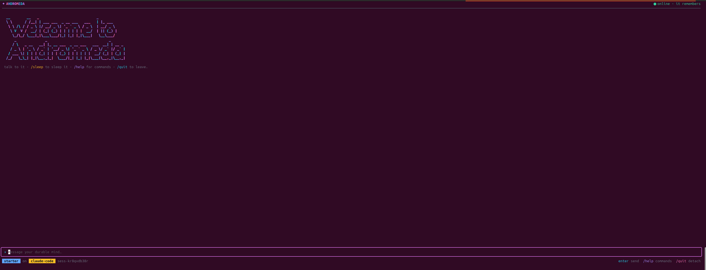

# ✦ andromeda

A beautiful terminal for **durable agent minds** on AgentPlane. Chat like any
CLI agent — except detaching never loses the conversation: the mind
checkpoints, sleeps for ~free, and wakes with full memory when you return.



```bash
npx @agentsupercluster/andromeda --agent buddy        # new mind, start chatting
npx @agentsupercluster/andromeda --session sess-…     # come back tomorrow — it remembers
npx @agentsupercluster/andromeda                      # see what agents/sessions exist
```

Making your own agent needs no checkout either — copy one that already runs on
your platform, edit its name and prompt, and apply it:

```bash
andromeda agent get starter > my-agent.yaml   # a real, working spec
andromeda agent create -f my-agent.yaml       # then: andromeda --agent my-agent
```

See [ONBOARDING.md](./ONBOARDING.md) for the guided version.

## Connecting

andromeda talks only to the AgentPlane control-plane API — a URL and a token
are the whole setup. Get both from whoever runs the cluster:

```bash
export ANDROMEDA_URL=https://agentplane.example.com     # or http://localhost:7433
export ANDROMEDA_TOKEN=…
```

## Keys while chatting

| Input | Action |
|---|---|
| Enter | send |
| `/sleep` | suspend — the mind checkpoints in place (any message wakes it) |
| `/sessions` | list your sessions for this agent |
| `/usage` | tokens & cost this session (as the harness reports them) |
| `/help` | list all commands |
| `/quit` | detach (Esc does the same) |
| Ctrl+S | alias for `/sleep` |
| Esc | detach — the mind keeps living; re-attach any time |

Anything starting with `/` is a command for the TUI — it never reaches the
agent.

## Development

Zero-build ESM: `node src/cli.mjs --help`. The backend contract is the
AgentPlane session-events dialect (JSON + SSE) — see the repo's
`docs/api.md`. This module never touches kubectl, gRPC, or the cluster.
